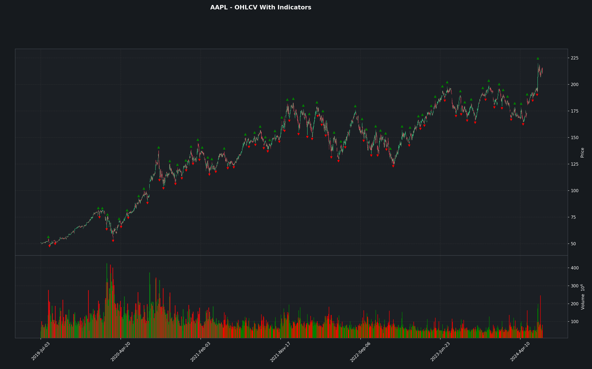

# Technical Analysis

### Overview

- **Supported Indicators**

  - Relative Strength Index (RSI)
  - Moving Average Convergence Divergence (MACD)
  - Exponential Moving Averages (EMA)
  - Bollinger Bands
  - ATR Bands
  - Stochastic Oscillator
  - Fibonacci Retracement

- **Other Features**
  - Historical Dividend Yields
  - Dynamically creating graphs with indicators.

---

### Setup

1. Clone git repository: `https://github.com/Primitive-Coding/TechnicalAnalysis.git`

2. Install the projects requirements with `pip install -r requirements.txt`

---

### Instructions

- Create a class instance.

```
    ta = TechnicalAnalysis()
```

- In this example we will be using OHLCV data from `yfinance`. You can install it via the `requirements.txt` file or with the command `pip install yfinance`.

```
    ticker = "AAPL"
    ta = TechnicalAnalysis()
    end = dt.datetime.now()
    # Class supports "Delta" creations to make date math easier.
    start = end - ta._get_delta(5, "Y")
    df = yf.download(ticker, start=start, end=end, actions=True)
```

###### RSI

- Below is how to get the RSI indicator. The function will return a `pandas.DataFrame` with a `RSI` column representing the RSI values, and a `RSI_MA` column representing a moving average of the RSI.

```
    # NOTE: rsi_window is 14 by default.
    rsi = ta.get_RSI(df["Close"], rsi_window=14)

    # Output
                RSI  RSI_MA
    Date
    2019-07-02   NaN     NaN
    2019-07-03   NaN     NaN
    2019-07-05   NaN     NaN
    2019-07-08   NaN     NaN
    2019-07-09   NaN     NaN
    ...          ...     ...
    2024-06-24 65.24   71.35
    2024-06-25 65.69   71.09
    2024-06-26 67.53   71.05
    2024-06-27 70.01   71.58
    2024-06-28 63.71   71.35

    # Add it to the dataframe.
    df["RSI"] = rsi["RSI"]
    df["RSI_MA"] = rsi["RSI_MA"]

```

###### MACD

- Below is how to get the MACD indicator. Note that the short, long, and signal window all have values predefined, but can be tuned if needed.

```
    macd = ta.get_MACD(df["Close"])

    # Output
                MACD  Signal Line  Histogram
    Date
    2019-07-02  0.00         0.00       0.00
    2019-07-03  0.03         0.01       0.03
    2019-07-05  0.06         0.02       0.04
    2019-07-08 -0.01         0.01      -0.02
    2019-07-09 -0.04         0.00      -0.04
    ...          ...          ...        ...
    2024-06-24  6.92         6.89       0.04
    2024-06-25  6.58         6.83      -0.24
    2024-06-26  6.58         6.78      -0.20
    2024-06-27  6.57         6.73      -0.17
    2024-06-28  6.20         6.63      -0.42

    # Add it to the dataframe.
    df["MACD"] = macd["MACD"]
    df["Signal Line"] = macd["Signal Line"]
    df["Histogram"] = macd["Histogram"]
```

###### EMA

- Below is how to get the EMA indicator.

```
    ema = ta.get_EMA(df["Close"], ema_window=9)

    # Output

    2019-07-02    50.68
    2019-07-03    50.77
    2019-07-05    50.82
    2019-07-08    50.66
    2019-07-09    50.59
                ...
    2024-06-24   208.38
    2024-06-25   208.52
    2024-06-26   209.47
    2024-06-27   210.39
    2024-06-28   210.44

    # Add it to the dataframe.
    df["EMA-9"] = ema

```

- Alternatively you can get a group of EMA. Note, that instead of passing a single column, we are passing the whole dataframe. This is so the new EMA columns can be added to our dataframe with less friction. We then get the dataframe returned from the function with our new EMA columns added. `ema_ranges` controls which EMA windows are used.

```
    df = ta.get_EMA_group(df, ema_ranges=[9, 20, 200])

    # Output, *NOTE* some columns are omitted for readability.

                EMA-9  EMA-20  EMA-200
    Date
    2019-07-02  50.68   50.68    50.68
    2019-07-03  50.77   50.72    50.69
    2019-07-05  50.82   50.75    50.69
    2019-07-08  50.66   50.68    50.68
    2019-07-09  50.59   50.65    50.68
    ...           ...     ...      ...
    2024-06-24 208.38  202.73   182.83
    2024-06-25 208.52  203.33   183.09
    2024-06-26 209.47  204.28   183.39
    2024-06-27 210.39  205.21   183.69
    2024-06-28 210.44  205.73   183.96
```

###### Bollinger Bands

- Below is how to get the Bollinger Bands indicator.

```
    bb_bands = ta.get_BB_Bands(df["Close"])

    # Output
                    upper_BB_band  lower_BB_band
    Date
    2019-07-02            NaN            NaN
    2019-07-03            NaN            NaN
    2019-07-05            NaN            NaN
    2019-07-08            NaN            NaN
    2019-07-09            NaN            NaN
    ...                   ...            ...
    2024-06-24         221.02         181.56
    2024-06-25         221.51         182.98
    2024-06-26         222.36         184.45
    2024-06-27         223.07         186.12
    2024-06-28         223.10         188.02

    # Add it to the dataframe.
    df["upper_BB_band"] = bb_bands["upper_BB_band"]
    df["lower_BB_band"] = bb_bands["lower_BB_band"]

```

###### Average True Range (ATR) Bands

- Below is how to get the ATR indicator.

```
    atr_bands = ta.get_ATR_Bands(df["High"], df["Low"], df["Close"])

    # Output
                    upper_ATR_band  lower_ATR_band
    Date
    2019-07-02             NaN             NaN
    2019-07-03             NaN             NaN
    2019-07-05             NaN             NaN
    2019-07-08             NaN             NaN
    2019-07-09             NaN             NaN
    ...                    ...             ...
    2024-06-24          212.70          189.88
    2024-06-25          213.79          190.70
    2024-06-26          215.41          191.40
    2024-06-27          216.75          192.44
    2024-06-28          218.14          192.98

    # Add it to the dataframe.
    df["upper_ATR_band"] = atr_bands["upper_ATR_band"]
    df["lower_ATR_band"] = atr_bands["lower_ATR_band"]
```

###### Stochastic Oscillator

- Below is how to get the Stochastic Oscillator indicator.

```
    oscillator = ta.get_Stochastic_Oscillator(df["High"], df["Low"], df["Close"])

    # Output
                D     K
    Date
    2019-07-02   NaN   NaN
    2019-07-03   NaN   NaN
    2019-07-05   NaN   NaN
    2019-07-08   NaN   NaN
    2019-07-09   NaN   NaN
    ...          ...   ...
    2024-06-24 58.99 57.01
    2024-06-25 57.34 60.32
    2024-06-26 64.18 75.22
    2024-06-27 71.27 78.25
    2024-06-28 73.11 65.85

    # Add it to the dataframe.
    df["D"] = oscillator["D"]
    df["K"] = oscillator["K"]
```

###### Fibonacci Retracement

- Below is how to get the Fibonacci Retracement indicator.

```


    # Output

            level1  level2  level3  level4  level5  min_price  max_price
    index
    2019-07-02  176.94  152.37  132.50  112.64   84.36      48.33     216.67
    2019-07-03  176.94  152.37  132.50  112.64   84.36      48.33     216.67
    2019-07-05  176.94  152.37  132.50  112.64   84.36      48.33     216.67
    2019-07-08  176.94  152.37  132.50  112.64   84.36      48.33     216.67
    2019-07-09  176.94  152.37  132.50  112.64   84.36      48.33     216.67
    ...            ...     ...     ...     ...     ...        ...        ...
    2024-06-24  176.94  152.37  132.50  112.64   84.36      48.33     216.67
    2024-06-25  176.94  152.37  132.50  112.64   84.36      48.33     216.67
    2024-06-26  176.94  152.37  132.50  112.64   84.36      48.33     216.67
    2024-06-27  176.94  152.37  132.50  112.64   84.36      48.33     216.67
    2024-06-28  176.94  152.37  132.50  112.64   84.36      48.33     216.67

    # Add it to the dataframe.
    df["fib_level1"] = oscillator["level1"]
    df["fib_level2"] = oscillator["level2"]
    df["fib_level3"] = oscillator["level3"]
    df["fib_level4"] = oscillator["level4"]
    df["fib_level5"] = oscillator["level5"]
    df["fib_min_price"] = oscillator["min_price"]
    df["fib_max_price"] = oscillator["max_price"]


```

###### On Balance Volume (OBV)

- Below is how to get the OBV indicator.

```
    obv = ta.get_OBV(df["Close"], df["Volume"])

    # Output

        Date
    2004-07-06             0.00
    2004-07-07     4,446,900.00
    2004-07-08     7,945,400.00
    2004-07-09     9,961,900.00
    2004-07-12    13,027,300.00
                    ...
    2024-06-24   274,763,000.00
    2024-06-25   274,047,200.00
    2024-06-26   273,115,100.00
    2024-06-27   273,986,100.00
    2024-06-28   270,513,600.00

    # Add it to the dataframe.
    df["OBV"] = obv
```

###### Dividends

- Below is how to get the historical dividends.
- _NOTE_ Supports
  - `quarterly` by setting `quarterly=True`
  - `biannual` by setting `biannual=True`
  - `monthly` by setting `monthly=True`
  - It is important to set this for the `annual_yield` calculation.

```
    dividends = ta.get_dividends(df["Close"], df["Dividends"], quarterly=True)

    # Output
                close dividend yield annual_yield
    Date
    2004-07-06  51.80     0.22  0.42         1.70
    2004-07-07  53.04     0.22  0.41         1.66
    2004-07-08  53.30     0.22  0.41         1.65
    2004-07-09  53.99     0.22  0.41         1.63
    2004-07-12  54.34     0.22  0.40         1.62
    ...           ...      ...   ...          ...
    2024-06-24 471.51     3.15  0.67         2.67
    2024-06-25 468.07     3.15  0.67         2.69
    2024-06-26 466.99     3.15  0.67         2.70
    2024-06-27 467.13     3.15  0.67         2.70
    2024-06-28 467.10     3.15  0.67         2.70
```

---

### Plotting

```
    ta.plot_graph(df, "AAPL")
```



###### Dynamically Add Indicators

- Each indicator is mapped to a tuple like this `(bool, bool)`.

  - The first bool determines if the indicator is added.
  - The second bool determines if the indicator is annotated. (See further for annotated examples)

- Dynamically add indicators to your charts with the function parameters.

```
    ta.plot_graph(df, "AAPL", rsi=(True, False), macd=(True, False))
```


###### Dynamically Add Annotations

- Setting the second bool to True, will add annotations to the indicator.

```
    ta.plot_graph(df, "AAPL", rsi=(True, True), macd=(True, True), bb_bands=(True, False))
```


